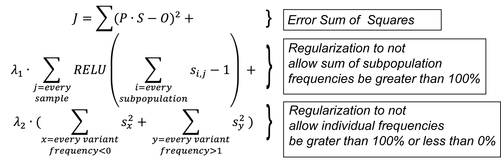
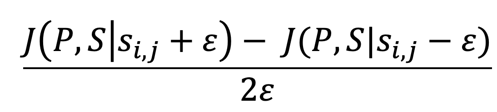

# Subpopulation decomposition

Decomposition of population deep-sequencing data into subpopulations using gradient descend algorithm.

## Motivation

As results of deep sequencing of samples from bacterial experimental evolution runs (usually with antibiotics stress) we observe variants frequencies fluctuations in range 0-100%. The big problem that it is not feasible to phase these variants from short-read Illumina sequencing as selection not allowing a lot of mutations and distance between variants exceed fragment length. However we observed that "naked eye" approach to phase mutations by subpopulations works in many cases which is confirmed by subsequent clonal sequencing. The idea of current algorithm is to make some estimation of population structure that could be used for the further analyses.

## Algorithm

In evolution experiments we usually produce time series of variant frequencies changes. Let's assume that we observe the following frequencies:

| ID   | Chrom      | Pos    | Ref | Alt | Time0 | Time1 | Time2 | Time3 |
| ---- | ---------- | ------ | --- | --- | ----- | ----- | ----- | ----- |
| Mut1 | CP009273.1 | 123456 | A   | T   | 0%    | 50%   | 30%   | 0%    |
| Mut2 | CP009273.1 | 574839 | G   | C   | 0%    | 60%   | 80%   | 100%  |
| Mut3 | CP009273.1 | 894759 | C   | A   | 0%    | 10%   | 50%   | 100%  |

However the population in reality could consist of 2 subpopulations SP1 and SP2:

| Subpopulation | Mut1 | Mut2 | Mut3 |
| ------------- | ---- | ---- | ---- |
| SP1           | +    | +    | -    |
| SP2           | -    | +    | +    |

The real subpopulation dynamics is:

| Subpopulation | Time0 | Time1 | Time2 | Time3 |
| ------------- | ----- | ----- | ----- | ----- |
| SP1           | 0     | 50%   | 30%   | 0%    |
| SP2           | 0     | 10%   | 50%   | 100%  |

However we can't observe these two tables and observe only their combination. E.g. Freq<sub>Mut1</sub>(Time1) = Presence<sub>Mut1</sub>(SP1) * Freq<sub>SP1</sub>(Time1) + Presence<sub>Mut1</sub>(SP2) * Freq<sub>SP2</sub>(Time1) = 1 * 50% + 1 * 10% = 60%

In general it meant that we could think of **O**bserved frequencies as a result of matrix dot product of **P**resence and **S**ubpopulation Frequencies matrices:


Or generalized:


Where **P** - binary matrix where elements could be 0 or 1. **S** and **O** matrices elements could be any real number, but should be in the biologically meaningful interval [0; 1] (from 0% to 100%). The additional constrains are:

1. The sum of subpopulation sequencies in any sample should be in the interval [0, 1].
2. Each frequency of subpopulation should be in the interval [0, 1]


Therefore it would be good to have estimates of matrices **P** and **S**. To produce them the modified gradient descend optimization was used.

The key element is the cost function:


where *lambda1* and *lambda2* are regularization constants, *RELU* is *max(0, x)* function.

### The algorithm:
1. Estimate number of subpopulations. This number will be used to initialize **P** and **S** matrices.
2. Initialize **P** matrix drawing "1" or "0" with some probability of drawing "1".
3. Initialize **S** matrix. For initialization the Dirichlet distribution is used for each subpopulation row so the sum of frequencies will be 1 for each subpopulation from the beginning.
4. Calculate current cost.
5. For each element of matrix **P** flip switch between 0 and 1 one by one and calculate cost. If the cost is less than the current cost then remember this number.
6. For each element *x<sub>i,j</sub>* of matrix **S** calculate  partial derivative of cost function using formula:<br>
<br>
where epsilon is small number (10^-3 by default).
Matrix **S** then updated using *P = P - alpha * grad(J)*, where alpha is learning rate.
7. Repeat 4-6 for predefined number of iterations.
8. Sum subpopulations in matrix **S** with identical [0/1] profiles in the matrix **P**.
9. Set negative elements in the matrix **P** to **0** (usually small negative numbers are present).

## Usage

```
usage: decompose.py [-h] [-t VAR_TABLE] [-p] [--lambda_sumclon LAMBDA_SUMCLON]
                    [--lambda_maxfreq LAMBDA_MAXFREQ] [-v VAR_PROB]
                    [--dirichlet_papam DIRICHLET_PAPAM] [-i ITERATIONS]
                    [-s N_SUBPOP] [-a ALPHA] [-e EPSILON] [-o OUT_DIR]

Performs observed variant frequency matrix decomposition into variant
presence binary matrix and subpopulation frequency matrix using gradient descend algorithm.

optional arguments:
  -h, --help            show this help message and exit
  -t VAR_TABLE, --var_table VAR_TABLE
                        Variant table. Columns: Chrom, Pos, Ref, Alt and
                        sample columns
  -p, --perc2prop       If frequencies are in percents bring them to
                        proportions. Default: False
  --lambda_sumclon LAMBDA_SUMCLON
                        Regularization parameter for controlling that sum of
                        clonal frequencies not greater than 100. Default: 4
  --lambda_maxfreq LAMBDA_MAXFREQ
                        Regularization for keeping frequencies in the [0
                        ,100]interval. Default: 4
  -v VAR_PROB, --var_prob VAR_PROB
                        Probability to draw 1 (presence of variant in sub-
                        population) at the initialization process. Default:
                        0.1
  --dirichlet_papam DIRICHLET_PAPAM
                        Parameter for Dirichlet distribution. Default: 0.1
  -i ITERATIONS, --iterations ITERATIONS
                        Number of iterations for gradient descend. Default:
                        500
  -s N_SUBPOP, --n_subpop N_SUBPOP
                        Estimated number of sub-populations.Default: 2x of
                        observed variants.
  -a ALPHA, --alpha ALPHA
                        Learning rate. Default: 0.005
  -e EPSILON, --epsilon EPSILON
                        Step for gradinet calculation. Default: 10^-3
  -o OUT_DIR, --out_dir OUT_DIR
                        Output directory. Default: output
```

### Input

The only mandatory input is a variant table. The table should contain columns:

1. "Chrom"
2. "Pos"
3. "Ref"
4. "Alt"
5. All other columns are considered as samples. The values (frequencies of observed variants) should be proportions [0, 1] or percents [0, 100] **without** a "%" sign. In the case of providing percents the `--perc2prop` option should be used.

### Output

The output directory contains the following files:

- Cost.tsv - Log of cost changes. Contains following columns:

   - iteration number
   - Error Sum of Squares
   - Cost
   - Change of Presence matrix (calculated as error sum of squares between current and previous iterations of **P** matrix)
   - Change of Subpopulations matrix
- Cost.pdf - Visualization of SSE and Cost over iterations.
- Presence_change.pdf - Visualization of Presence matrix changes.
- Subpop_change.pdf - Visualization of Substitutions matrix changes.
- freq_sub.tsv - Resulted **S** matrix *__before__* collapsing identical subpopulations.
- presence_sub.tsv - Resulted **P** matrix *__before__* collapsing identical subpopulations.
- reconstructed.tsv - Resulted reconstructed **O'** matrix *__before__* collapsing identical subpopulations. **O'** = **P** * **S**.
- freq_sub_collapsed.tsv - Resulted **S** matrix *__after__* collapsing identical subpopulations.
- presence_sub_collapsed.tsv - Resulted **P** matrix *__after__* collapsing identical subpopulations.
- reconstructed_collapsed.tsv - Resulted reconstructed **O'** matrix *__after__* collapsing identical subpopulations. **O'** = **P** * **S**.
